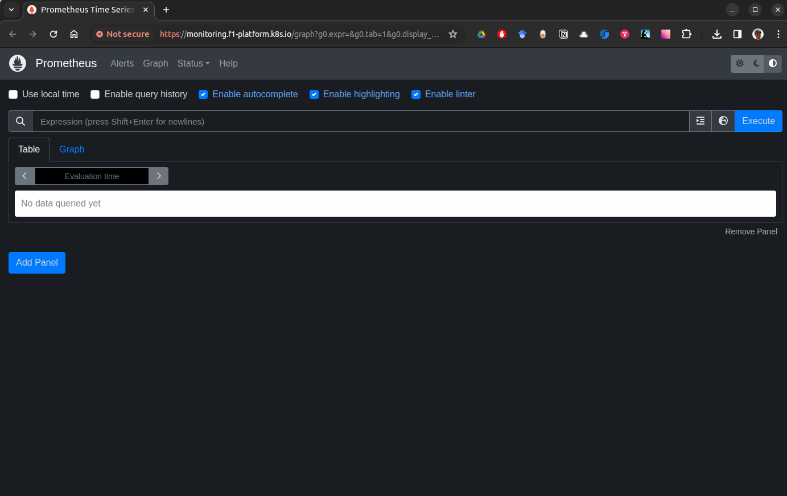
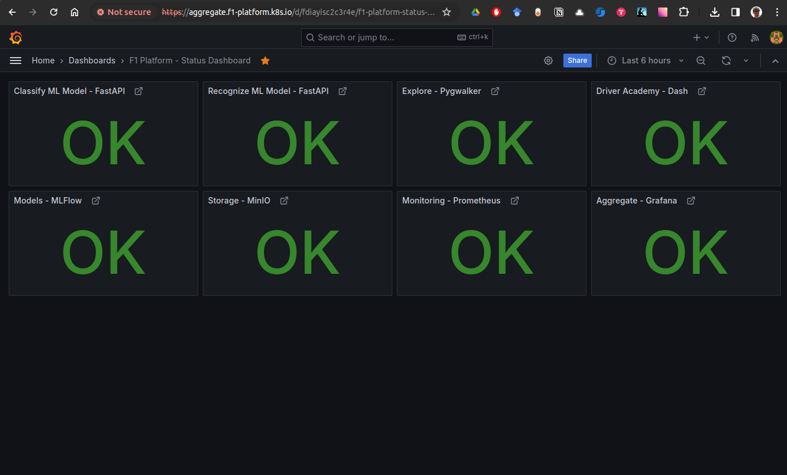

# prometheus-stack-helm
Repository holding code for deploying necessary objects to access Community-based Prometheus/Grafana monitoring and observability stack.

# Example
## Homepage

## Dashboard


## Live demo
You can see the dashboard live [here, on Raintank.io](https://snapshots.raintank.io/dashboard/snapshot/aWgme2LcBbcMGJKDdWF9zoVKqJoOrxQz?orgId=0&fbclid=IwAR18eVZCqc1DH5hWIXbam2jw48poUQIZh2El7av8FSbRVytsp7NjB1pKtCM)

# Execution steps
## 0. RUNNING MINIKUBE LOCAL CLUSTER ##
0.1. `minikube start`
```
😄  minikube v1.32.0 on Ubuntu 19.10
✨  Using the docker driver based on existing profile
💨  For improved Docker performance, Upgrade Docker to a newer version (Minimum recommended version is 20.10.0, minimum supported version is 18.09.0, current version is 19.03.8)
👍  Starting control plane node minikube in cluster minikube
🚜  Pulling base image ...
🏃  Updating the running docker "minikube" container ...
🐳  Preparing Kubernetes v1.28.3 on Docker 24.0.7 ...
🔎  Verifying Kubernetes components...
    ▪ Using image gcr.io/k8s-minikube/storage-provisioner:v5
🌟  Enabled addons: storage-provisioner, default-storageclass

❗  /usr/bin/kubectl is version 1.18.0, which may have incompatibilities with Kubernetes 1.28.3.
    ▪ Want kubectl v1.28.3? Try 'minikube kubectl -- get pods -A'
🏄  Done! kubectl is now configured to use "minikube" cluster and "default" namespace by default
```
0.2. `minikube dashboard`
```
🔌  Enabling dashboard ...
    ▪ Using image docker.io/kubernetesui/dashboard:v2.7.0
    ▪ Using image docker.io/kubernetesui/metrics-scraper:v1.0.8
💡  Some dashboard features require the metrics-server addon. To enable all features please run:

        minikube addons enable metrics-server


🤔  Verifying dashboard health ...
🚀  Launching proxy ...
🤔  Verifying proxy health ...
🎉  Opening http://127.0.0.1:43709/api/v1/namespaces/kubernetes-dashboard/services/http:kubernetes-dashboard:/proxy/ in your default browser...
Opening in existing browser session.
```
0.3 `minikube addons enable ingress`
```
💡  ingress is an addon maintained by Kubernetes. For any concerns contact minikube on GitHub.
You can view the list of minikube maintainers at: https://github.com/kubernetes/minikube/blob/master/OWNERS
    ▪ Using image registry.k8s.io/ingress-nginx/controller:v1.9.4
    ▪ Using image registry.k8s.io/ingress-nginx/kube-webhook-certgen:v20231011-8b53cabe0
    ▪ Using image registry.k8s.io/ingress-nginx/kube-webhook-certgen:v20231011-8b53cabe0
🔎  Verifying ingress addon...
🌟  The 'ingress' addon is enabled
```

## 1. INSTALLING HELM CHART ##
`helm install prometheus prometheus-stack-helm/`
```
# Output:
# NAME: prometheus
# LAST DEPLOYED: Tue Apr  9 22:29:01 2024
# NAMESPACE: default
# STATUS: deployed
# REVISION: 1
# TEST SUITE: None
# NOTES:
# Thank you for installing prometheus-stack-helm.
# 
# Please be advised, that beforehand you need to install Prometheus and Grafana on your cluster - as this chart just conviniently does service/ingress for Commuinty Prometheus stack.
# 
# It's the best to do it with:
#     $ helm repo add prometheus-community https://prometheus-community.github.io/helm-charts
#     $ helm repo update
#     $ helm install prometheus prometheus-community/kube-prometheus-stack -n f1-platform
```

## 2. UNINSTALLING HELM CHART ##
`helm uninstall prometheus`